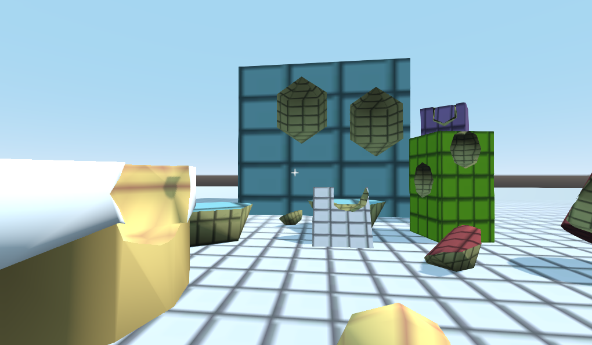
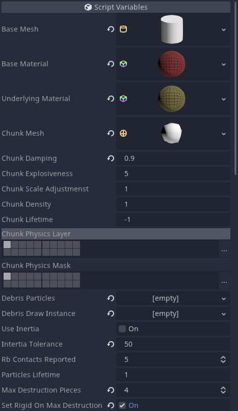

# godot-destructible-body
A dynamic destruction plugin for the Godot Game Engine.

by Toadile

# Overview

This plugin is designed to provide plug-and-play destruction the Godot game engine (3.x). This plugin uses constructive geometry shapes (CSG) to dynamically break off chunks of objects.

The key function to call is *_destruct(collision_point : Vector3, normal : Vector3, size : float)*

## Configuration
DestructibleBody, the base class, has the following configuration parameters:

### Base Mesh
The base mesh of this DestructibleBody. This geometry defines all destruction.
### Base Material
This is the material applied to the base mesh.
### Underlying Material
This is the material applied to any chunks broken off. Any textures are recommended to lack show internals of the object. Also, using object-based triplanar mapping is recommended for uniformity.
### Chunk Mesh
This is the mesh that will take a bite out of the base mesh upon *_destruct* and form a new chunk.
### Chunk Damping
This is the general damping (both linear and angular) of the chunk's RigidBody properties.
### Chunk Explosiveness
This informs how much the chunk is "launched" away from the base object.
### Chunk Scale Adjustment
This adjusts how big chunks are generally taken out of the base mesh.
### Chunk Density
The density of the chunk. This is used to roughly calculate the RigidBody mass.
### Chunk Lifetime
This is the lifetime of a chunk in seconds after the chunk is separated. If negative, the chunk will never be deleted.
### Chunk Physics Layer
This is the collision layer for the chunk.
### Chunk Physics Mask
This is the collision mask for the chunk.
### Debris Particles
This is a Particles Material resource for various debris that is spawned at a chunk's location.
### Debris Draw Instance
This is similar to what would be configured for a Particles' Draw Instance. This is what each individual particle is rendered to be.
### Use Inertia
When checked, this enables inertia or momentum (mass*velocity) destruction when colliding with another RigidBody.
### Inertia Tolerance
The inertia at which *_destruct* will be called upon a collision
### Rb Contacts Reported
The number of contacts reported in the RigidBody. By default in RigidBody this is 0 so if you want to enable inertia destruction, this needs to be at least 1. Be aware that contact with the floor or another other physics body is counted.
### Particles Lifetime
The lifetime of the spawned debris particles.
### Max Destruction Pieces
The maximum number of *_destruct* operations that can occur on the object. It is recommended that this is below 10 for ideal performance.
### Set Rigid On Max Destruction
When the maximum number of destruction pieces has been reached, if this is checked, the base object will be physically affected like any other standard RigidBody. For example, if a column was "fully destructed" it would topple over.

## Technical Details
The base class is DestructibleBody, which extends Rigidbody. This is forced to be in static mode. The base mesh provided is used to make a base CSG on runtime which will be used to remove "chunks" when the *_destruct* method is called, which takes in the collision position and the surface normal at the collision point.